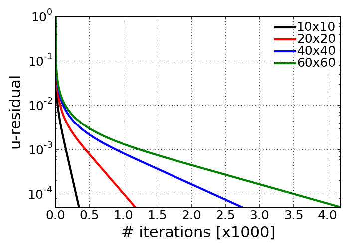
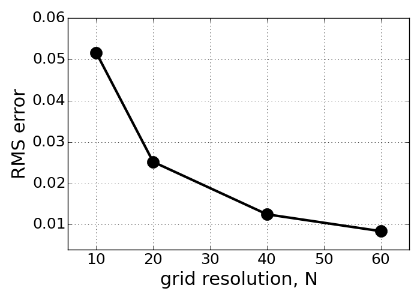
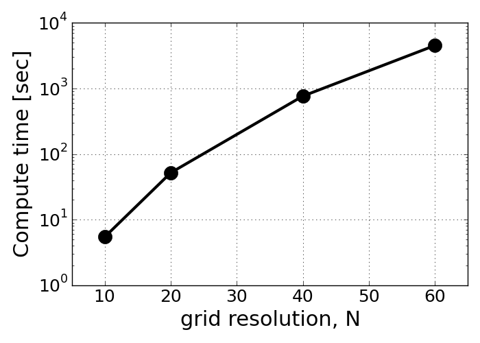

================
 Problem1 - e, f
================

Compare your results with different grid resolutions to evaluate the numerical error and the order of the scheme.

**Re = 100**

- Residual of u-velocity change in numerical iteration

- RMS error of u-velocity (reference: Ghia's v-velocity data)

- Computational time with different grid spacing

